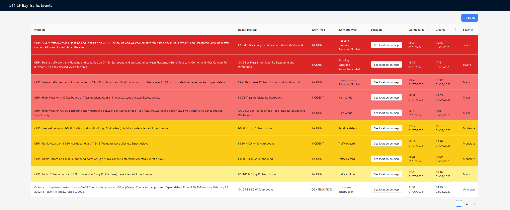
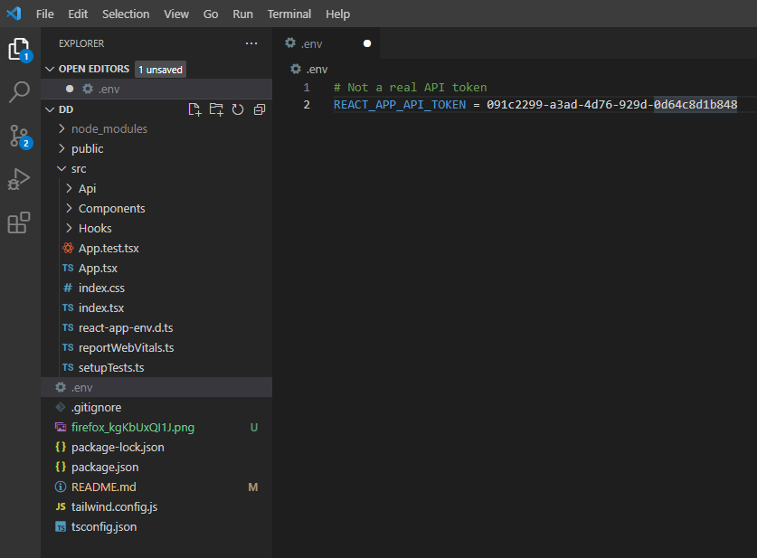

# 511 SF Bay Traffic Events

Displays traffic events grouped by severity in the SF Bay area



## Requirements

```
Nodejs 18+
npm 8+
```

https://nodejs.org/en/

Create a `.env` file in the root folder of the project containing the api token under `REACT_APP_API_TOKEN`.
Should look something like this:



## Running locally

Run `npm i` to install dependencies locally. Afterwards `npm start` to run the application.
